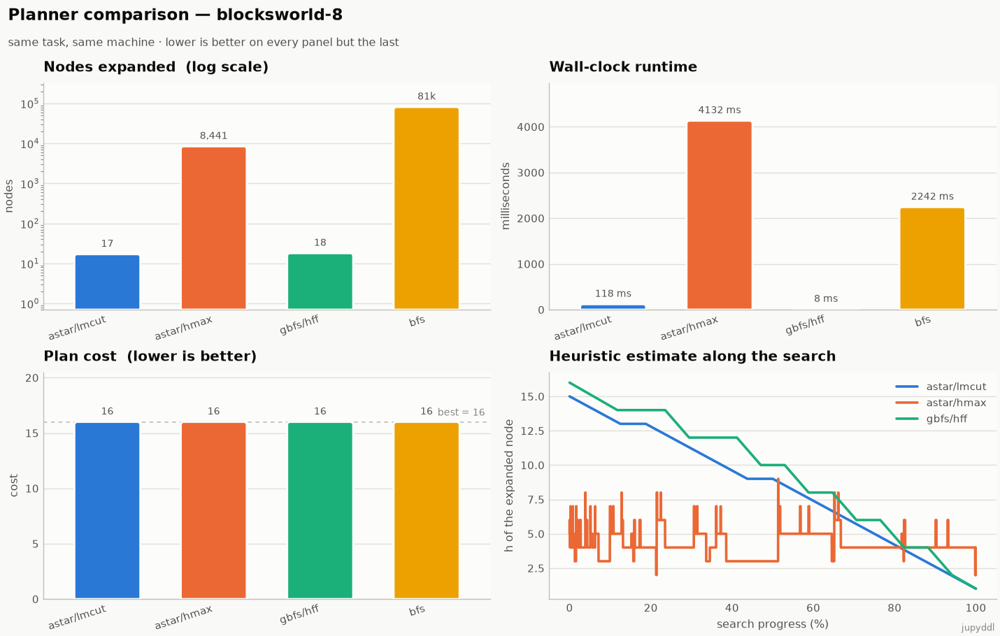
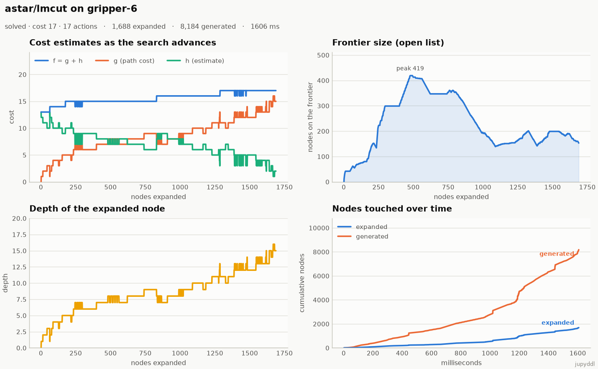
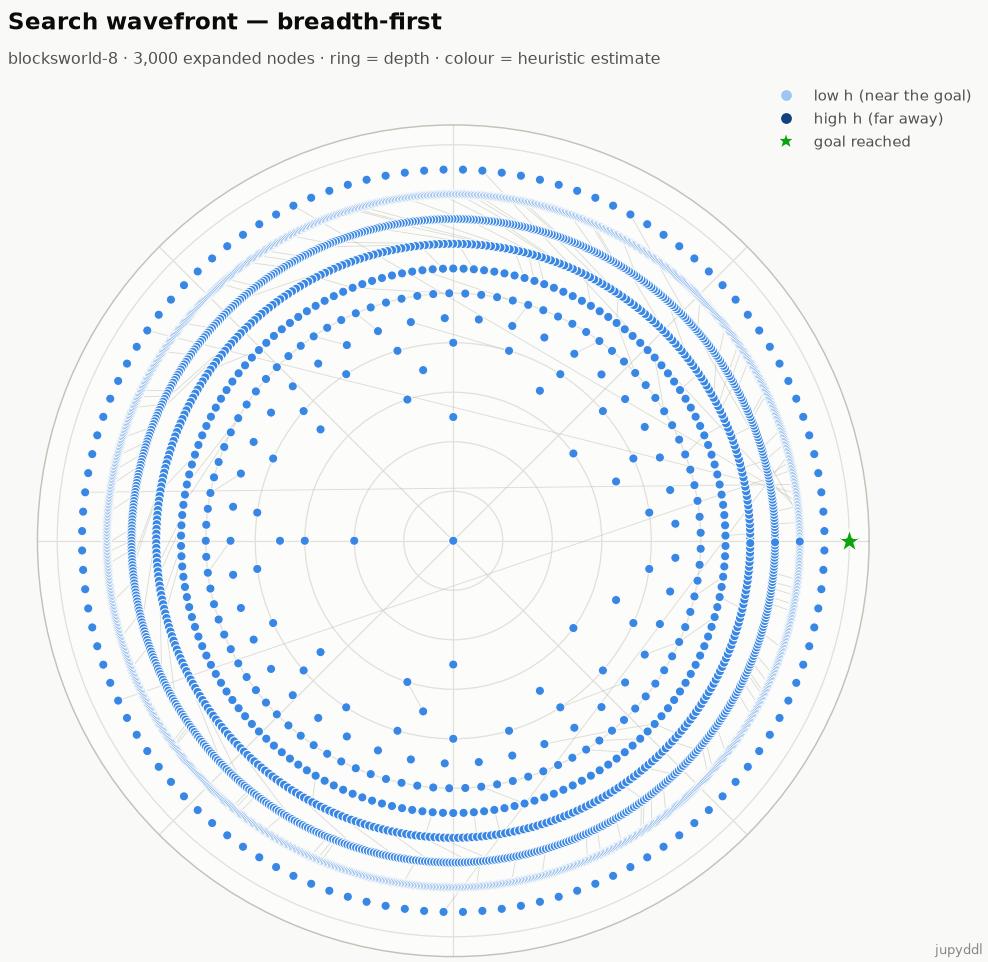
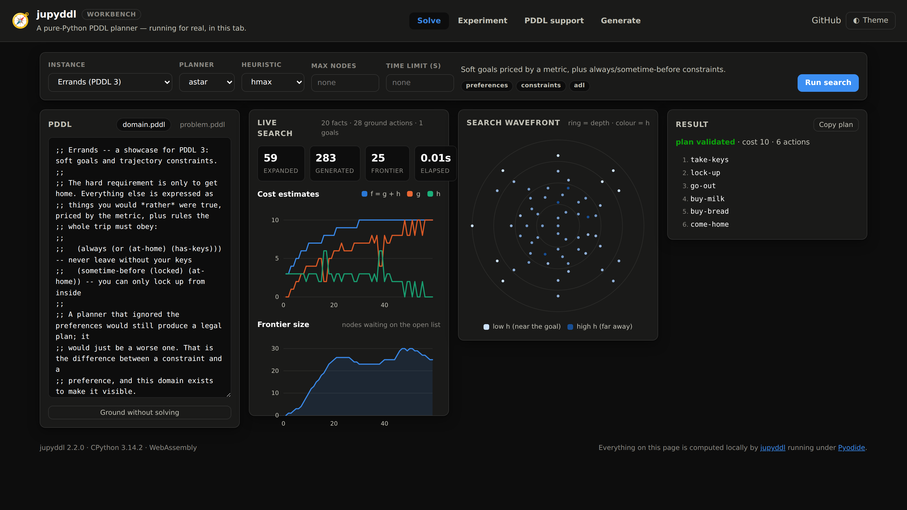
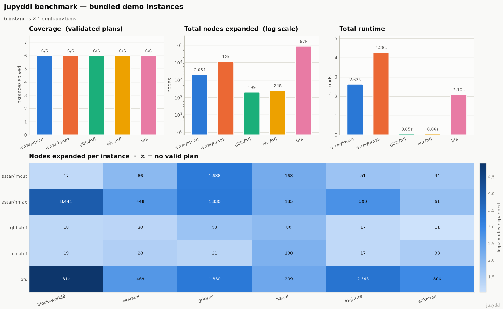

<div align="center">

# jupyddl — Python PDDL

A dependency-free, pure-Python PDDL planning framework: parser, grounder,
classical-to-SOTA planners, heuristics, benchmarking — and a search you can
actually *watch*.

**[▶ Open the workbench](https://openplan-labs.github.io/PythonPDDL/)** ·
[Watch the 105-second tour](.docs/assets/jupyddl-promo.mp4)

The repository is `PythonPDDL`; the package is `jupyddl`. That is what you
install and what you import.

</div>

<div align="center">

[](https://pypi.org/project/jupyddl/)
[](https://pypi.org/project/jupyddl/)


[](./LICENSE)

</div>

`jupyddl` started life as a university project: a thin Python wrapper around the
Julia `PDDL.jl` parser, with a `requirements.txt` that pulled in a whole second
language runtime. It has since been **rewritten from scratch as a pure-Python
framework** — no Julia, no native dependencies, just the standard library — so it
is trivial to install, embed, teach with, and build on.

<div align="center">

<picture>
  <source media="(prefers-color-scheme: dark)" srcset=".docs/assets/comparison-dark.png">
  
</picture>

</div>

## Features

- 🧩 **Hand-written PDDL parser** and grounder covering **STRIPS, full ADL,
  derived predicates, numeric fluents, durative actions, trajectory
  constraints, preferences, timed initial literals and object fluents** — 20 of
  the 21 requirement flags, with the last one refused by name rather than
  ignored. ([the full matrix](#pddl-support))
- 🔎 **14 planners**: BFS, DFS, Iterative Deepening, Dijkstra, Greedy Best-First,
  A*, Weighted A*, IDA*, Enforced Hill Climbing, hill climbing, beam search,
  Iterated Width, branch and bound, and anytime weighted A*.
- 📊 **Heuristics from classical to SOTA**: blind, goal-count, `h_max`, `h_add`,
  FF (`h_ff`), critical-path `h^m` (`h1`/`h2`), and **LM-cut**.
- 🧠 **Learned heuristics** trained from your own solved plans, then tuned
  against the number of nodes search expands rather than against `h*`. On
  blocksworld this beats `h_ff` by ~4× in expansions and ~15× on the clock, at
  instance sizes three times larger than it trained on.
  ([how, and when it fails](#learned-heuristics))
- ⏱️ **Search budgets** on every planner: bound a run by nodes or by seconds and
  a truncated result says so, so "we stopped looking" never masquerades as
  "no plan exists".
- 🎲 **Reproducible instance generators** — seven parametrised domains where the
  same *(kind, size, seed)* always yields byte-identical PDDL.
- 🎥 **Watch the search happen**: an observer hook on every planner feeds
  recorded traces, publication-ready charts, animations, and a live terminal
  dashboard that needs *no dependencies at all*.
- 🌐 **A browser workbench** running this exact library under Pyodide: solve,
  sweep an experiment matrix, browse the support table, generate instances.
  Nothing is uploaded.
- ⚖️ **Benchmarking harness** for comparative analysis with CSV export and a
  full dashboard.
- 🧱 **Extensible by design**: planners, heuristics and generators live behind
  simple registries; add your own in a few lines.
- ✅ **Zero runtime dependencies** and a comprehensive test suite.

## Install

Requires Python ≥ 3.10, and nothing else:

```bash
pip install jupyddl                 # the framework and the CLI
pip install "jupyddl[viz]"          # + matplotlib, for the charts and animations
pip install "jupyddl[viz,learn]"    # + numpy, which only makes learning faster
```

To work on it, from a clone, using [uv](https://docs.astral.sh/uv/):

```bash
uv venv
uv pip install -e ".[dev,viz,learn]"
```

or with plain pip:

```bash
python -m pip install -e ".[dev,viz,learn]"
```

The core framework needs nothing but the standard library. `viz` is only for
the matplotlib charts; `learn` is only for speed — `jupyddl.learn` trains and
evaluates on the standard library alone, NumPy just makes it one to two orders
of magnitude faster.

## Command line

```bash
# Solve a single instance
jupyddl solve demos/hanoi/domain.pddl demos/hanoi/problem.pddl \
    --search astar --heuristic lmcut

# Watch it search, live, in your terminal (no dependencies needed)
jupyddl solve demos/gripper/domain.pddl demos/gripper/problem.pddl --live

# Record the search and draw it
jupyddl solve demos/gripper/domain.pddl demos/gripper/problem.pddl \
    --trace run.json --plot progress.png --tree wavefront.png

# Replay a search as a video
jupyddl animate demos/blocksworld8/domain.pddl demos/blocksworld8/problem.pddl \
    -o search.mp4 --search bfs --heuristic none

# Compare planners over a folder of <name>/{domain,problem}.pddl instances
jupyddl benchmark demos --planners bfs,dijkstra,astar,gbfs,ehc --heuristic hff \
    --csv results.csv --dashboard benchmark.png

# Render every chart for every bundled demo
jupyddl demo -o gallery --both-modes

# What PDDL does this thing actually support?
jupyddl requirements --verbose

# Generate a reproducible difficulty ladder
jupyddl generate gripper --size 2 --count 8 --step 2 -o instances/

# Bound any run by nodes or by seconds
jupyddl solve demos/blocksworld12/domain.pddl demos/blocksworld12/problem.pddl \
    --search gbfs --heuristic hff --time-limit 10
```

### The live dashboard

`--live` repaints a compact view of the search as it runs — sparklines for the
heuristic and the `f` frontier, a frontier gauge, live counters and a node rate.
It is pure standard library (ANSI escapes and Unicode blocks), and it degrades to
a periodic one-line report when the output is not a terminal, so it is safe in CI
logs and notebooks too.

```
jupyddl · astar/lmcut · gripper-6  (28 facts, 52 ground actions)
────────────────────────────────────────────────────────────────
  h  ▆▇▇█▇▅▄▅▅▄▄▄▃▃▂▂▁▂▁▁   now 2  best 1
  f  ████████████████████   now 17
  frontier  ████████░░░░░░░░░░  201  (peak 384)
  1,522 expanded   7,482 generated   1,721 evaluated
  891 nodes/s · 1.71s
  ✔ solved · cost 17 · 17 actions · 1.77s
```

## Library usage

```python
from jupyddl import solve, build_task, solve_task, trace_search, validate_plan

# One-shot solve
result = solve("demos/hanoi/domain.pddl", "demos/hanoi/problem.pddl",
               search="astar", heuristic="lmcut")
print(result.solved, result.cost, result.plan_names())

# Ground once, try several configurations
task = build_task("demos/blocksworld8/domain.pddl",
                  "demos/blocksworld8/problem.pddl")
for search, heuristic in [("astar", "lmcut"), ("gbfs", "hff"), ("bfs", None)]:
    r = solve_task(task, search, heuristic)
    assert validate_plan(task, r.plan)
    print(search, heuristic, r.cost, r.stats.expanded, "expanded")
```

### Recording and plotting a search

Every planner accepts an `observer`. `trace_search` wires up a recorder for you
and hands back a replayable `SearchTrace`:

```python
from jupyddl import build_task, trace_search
from jupyddl.viz import plot_search_progress, plot_search_tree, animate_search

task = build_task("demos/gripper/domain.pddl", "demos/gripper/problem.pddl")
result, trace = trace_search(task, "astar", "lmcut")

print(trace.summary())
trace.save("run.json")                      # portable JSON, replayable later

plot_search_progress(trace, "progress.png") # cost curves, frontier, depth, throughput
plot_search_tree(trace, "wavefront.png")    # the shape of the search itself
animate_search(trace, "search.mp4")         # replay it as a video
```

Tracing is entirely opt-in and transparent: with no observer the planners never
touch the instrumentation, so the default search path keeps its zero-overhead,
zero-dependency behaviour. (The test suite asserts that an observed search
returns exactly the same plan and statistics as an unobserved one.)

<div align="center">

<picture>
  <source media="(prefers-color-scheme: dark)" srcset=".docs/assets/search-progress-dark.png">
  
</picture>

</div>

The wavefront chart lays each expanded node on a ring by its depth and colours it
by its heuristic estimate, so a well-guided search reads as a narrow spike and a
blind one fills the whole disc:

<div align="center">

<picture>
  <source media="(prefers-color-scheme: dark)" srcset=".docs/assets/wavefront-dark.png">
  
</picture>

</div>

### Writing your own observer

`SearchObserver` hooks default to no-ops, so you override only what you need:

```python
from jupyddl import build_task, solve_task
from jupyddl.trace import SearchObserver

class StallDetector(SearchObserver):
    """Shout when the search spends too long without improving h."""

    def __init__(self, patience=500):
        self.patience, self.best, self.since = patience, float("inf"), 0

    def on_expand(self, state, h=0.0, stats=None, **kwargs):
        if h < self.best:
            self.best, self.since = h, 0
        else:
            self.since += 1
            if self.since == self.patience:
                print(f"plateau at h={self.best} after {stats.expanded} expansions")

task = build_task("demos/gripper/domain.pddl", "demos/gripper/problem.pddl")
solve_task(task, "gbfs", "hff", observer=StallDetector())
```

## The browser workbench

**[openplan-labs.github.io/PythonPDDL](https://openplan-labs.github.io/PythonPDDL/)**

The workbench runs *this library*, unmodified, compiled to WebAssembly by
[Pyodide](https://pyodide.org) — not a JavaScript re-implementation. Because the
core is stdlib-only there is no wheel to resolve: the package sources are handed
straight to the interpreter. Everything is computed in your tab; nothing is
uploaded.

Five views:

- **Solve** — edit the PDDL, pick a planner, a heuristic and a budget, then watch
  the cost curves and the search wavefront animate while it works. Or ground
  without solving, to see what the instance actually compiles to.
- **Experiment** — sweep an instance × configuration matrix. Every configuration
  runs against the same grounding, rows stream in as they finish, the table
  sorts on any column, and the whole run exports to CSV or JSON.
- **PDDL support** — the requirement matrix, filterable by support level, read
  straight out of the library rather than transcribed.
- **Research** — what `jupyddl.learn` measured: the imitation result, what the
  reinforcement stage added, the domain where the whole approach loses and the
  exact reason, and the three claims that turned out to be wrong.
- **Generate** — produce a reproducible instance from a *(kind, size, seed)* and
  open it in Solve.

The pages that are only text and measurements — **PDDL support** and
**Research** — render immediately from the committed bundle. Only the controls
that actually run a planner wait for the interpreter, so reading the workbench
never costs a 10 MB download.

<div align="center">



</div>

Build and serve it locally:

```bash
python tools/build_web.py          # bundle the package + demos into web/dist
python -m http.server -d web 8000  # then open http://localhost:8000
```

`web/dist` is committed so the page works from a plain clone; CI fails if it
drifts out of step with the sources.

## Generating instances

A benchmark needs a difficulty ladder, and hand-writing one is tedious. The
generators are seeded, so a published experiment can be reproduced exactly —
the same *(kind, size, seed)* always emits byte-identical PDDL.

```python
from jupyddl.generator import generate, write_instance

domain, problem = generate("blocksworld", size=10, seed=7)
ladder = [write_instance("gripper", "instances/", size=n, seed=1)
          for n in range(2, 16, 2)]
```

| Generator | What it stresses |
|---|---|
| `blocksworld` | deep plans, plateaus |
| `gripper` | high branching factor |
| `logistics` | action costs, type hierarchy |
| `rovers` | ADL — disjunctive and existential preconditions |
| `numeric-transport` | numeric fluents: fuel and refuelling |
| `workshop` | durative actions and makespan |
| `random-strips` | random operators around a planted solution chain |

`random-strips` plants a reachable chain and buries it in distractor actions:
purely random operators are almost always unsolvable, which makes for a useless
benchmark. The test suite grounds and solves everything each generator emits.

## Learned heuristics

Every solved instance is a labelled trajectory: the cost of a plan's suffix from
any state on it is that state's cost-to-go. `jupyddl learn` turns a corpus of
those into a heuristic, then — optionally — stops imitating `h*` and starts
optimising the thing that actually matters, the number of nodes search expands.

```bash
# generate a ladder, solve it, fit a heuristic, tune it on search cost
jupyddl learn blocksworld --sizes 3-6 --cem 10 --evaluate 9-13 -o bw.heur.json

# then use it anywhere a heuristic name is accepted
jupyddl solve domain.pddl problem.pddl -s gbfs -H learned:bw.heur.json
jupyddl benchmark demos --planners gbfs --heuristic learned:bw.heur.json
```

Trained on 3–6 block instances, evaluated on 9–13 block instances it has never
seen, against greedy best-first search:

| heuristic | coverage | expansions | seconds | plan cost |
|---|---|---|---|---|
| **`learned`** | 1.00 | **137** | **0.036** | **48.2** |
| `hff` | 1.00 | 518 | 0.534 | 51.8 |
| `goalcount` | 1.00 | 2483 | 0.154 | 51.0 |

Nearly four times fewer expansions than `hff` and about fifteen times faster,
because the network is a thousand multiply-adds and `hff` is a relaxed-plan
extraction. These are read from `.docs/assets/rl-data.json`, the cache the published
[Research view](https://openplan-labs.github.io/PythonPDDL/) renders from, so
the page and this table cannot drift apart.

It does not always win — on logistics it loses to `hff` by 6× and the reason is
exact rather than mysterious: that domain has two predicates, so the feature
vector cannot tell *which* package is where, only how many are somewhere. That
result, the RL formulation, and what to build next are written up in
[`.docs/`](.docs/), and there is a
[97-second tour of the RL half](.docs/assets/jupyddl-rl.mp4) — including the two
measurement mistakes that shaped the design.

Read the 137 as a mean over a heavy tail: nine of the ten held-out instances sit
between 58 and 227 expansions and the tenth moves the average on its own. The
firmest claim is the coverage one — imitation could not solve that instance
inside 30 000 expansions, and the tuned heuristic solves it in 214.

```python
from jupyddl.learn import learn_heuristic

bundle = learn_heuristic("gripper", sizes=range(2, 6), cem_iterations=10)
bundle.save("gripper.heur.json")
```

The learning stack is stdlib-only like the rest of the core; `pip install
jupyddl[learn]` adds NumPy purely for speed. A learned heuristic is **not
admissible** — nothing in the objective bounds it from above — so pair it with
`gbfs`, or `wastar` if you want a bounded-suboptimality knob.

## Soft goals and trajectory constraints

Preferences say what you would *rather* were true; constraints say what must
hold along the whole trajectory. Both compile away before the search runs.

```lisp
(:constraints (and
  (always (or (at-home) (has-keys)))      ; never leave without your keys
  (sometime-before (locked) (at-home))))  ; you can only lock up from inside

(:goal (and (at-home) (locked)
            (preference milk   (bought-milk))
            (preference letter (posted-letter))))

(:metric minimize (+ (total-cost)
                     (+ (* 6 (is-violated milk)) (* 2 (is-violated letter)))))
```

Milk is worth 6 and costs 1 to buy, so the optimal plan fetches it. The letter
is worth 2 and costs 3 to post, so the optimal plan **skips it and pays the
penalty** — which is the whole point of a soft goal, and something a planner
that quietly treated preferences as hard goals would get wrong.

Preferences become a priced choice behind a *closing* action that freezes the
state, so a preference cannot be satisfied halfway through and then broken.
`always` becomes a precondition on every action plus a goal conjunct; `sometime`
and `sometime-before` use monitor facts the planner sets when it can;
`sometime-after` and `at-most-once` use *forced* monitors on conditional
effects, because a constraint the planner could satisfy by not looking would not
be a constraint.

## Benchmarking

```bash
jupyddl benchmark demos --planners astar,gbfs,ehc,bfs --heuristic hff \
    --csv results.csv --dashboard benchmark.png
```

<div align="center">

<picture>
  <source media="(prefers-color-scheme: dark)" srcset=".docs/assets/benchmark-dark.png">
  
</picture>

</div>

## Demo instances

`demos/` holds thirteen instances chosen to stress different parts of the framework —
and to make the difference between planners obvious:

| Instance | What it exercises | Optimal cost |
|---|---|---:|
| `gripper` | high branching factor, classic IPC domain | 17 |
| `blocksworld8` | deep plans and heavy plateaus | 16 |
| `blocksworld12` | twelve blocks — satisficing planners only, in practice | — |
| `hanoi` | untyped domain, exponential space, closed-form answer (2⁵−1) | 31 |
| `logistics` | type hierarchy and `:action-costs` | 24 |
| `sokoban` | static-predicate pruning, irreversible moves, dead ends | 11 |
| `elevator` | `when` conditional effects | 14 |
| `rovers` | **ADL**: `or` and `exists` in preconditions | 11 |
| `network` | **derived predicates**: recursive reachability axioms | 7 |
| `numeric-transport` | **numeric fluents**: fuel burnt by driving, restored by refuelling | 11 |
| `workshop` | **durative actions**: plans report a makespan | 33 |
| `errands` | **preferences + constraints**: soft goals priced by a metric | 10 |
| `timed-market` | **timed initial literals**: the plan waits for opening time | 4 |

Two of them are byte-for-byte generator output — `blocksworld12` is
`generate blocksworld --size 12 --seed 3`, `workshop` is
`generate workshop --size 3 --seed 1`. The rest were either hand-written
(`sokoban`, `hanoi`, `elevator`, `errands`, `timed-market`, and `network`,
whose recursive axiom is the point of it) or generated and then edited by hand,
so `generate` will produce something equivalent but not identical.

The `pddl-examples` git submodule supplies the smaller instances used by the
parser and grounder tests.

## Available planners & heuristics

| Kind | Planners |
|---|---|
| Uninformed | `bfs`, `dfs`, `iddfs`, `dijkstra` |
| Informed best-first | `gbfs`, `astar`, `wastar`, `idastar` |
| Local / bounded | `ehc`, `hc`, `beam`, `iw` |
| Anytime / optimal | `bnb`, `awastar` |

Heuristics: `blind`, `goalcount`, `hmax`, `hadd`, `hff`, `h1`, `h2`/`hm`, `lmcut`.

`astar`, `idastar` and `bnb` are cost-optimal given an **admissible** heuristic
— `blind`, `hmax`, `h1`/`h2`, `lmcut`. `dijkstra` is cost-optimal
unconditionally. `bfs` and `iddfs` minimise **plan length**, which is the same
thing only when every action costs the same; on a domain with `:action-costs`
they will happily return a shorter, more expensive plan. `bnb` also carries a
default ceiling (200 000 expansions, depth 200), and a run that hits it is no
longer a proof of optimality. `awastar` lowers its weight until it reaches
plain A*, so its last plan is optimal if the run completes **and** the
heuristic is admissible. `hc`, `beam` and `iw` trade completeness for speed, and `iw` needs
no heuristic at all — it prunes by *novelty* instead.

## PDDL support

**20 of the 21 requirement flags are supported.**
6 are modelled natively, 7 are compiled into the core
representation, and 7 are supported with a documented restriction.
Exactly 1 is **refused at parse time with an explanation** — never
silently ignored, because a silently ignored requirement produces plans that are
wrong rather than absent.

```bash
jupyddl requirements            # the table below, in your terminal
jupyddl requirements --verbose  # with the full compilation notes
```

| Requirement | PDDL | Support | What jupyddl does |
|---|---|---|---|
| `:action-costs` | 3.0 | **native** | `(increase (total-cost) k)` and metric minimisation. Operator costs feed straight into g, so A*/Dijkstra optimise cost. |
| `:conditional-effects` | 1.2 | **native** | `when` and `forall` inside effects. Kept explicitly in the grounded operator and evaluated against the state at application time. |
| `:derived-predicates` | 2.2 | **native** | `(:derived ...)` axioms. Rules are grounded and evaluated to a least fixpoint after every state change, so planners and heuristics always see closed states. Derived predicates may not appear in action effects. |
| `:equality` | 1.2 | **native** | `=` between terms. Evaluated during grounding; infeasible instances are dropped. |
| `:strips` | 1.2 | **native** | Add/delete effects over positive literals. The core representation. Everything else compiles down to this. |
| `:typing` | 1.2 | **native** | Typed parameters and objects, with type hierarchies. Subtypes are resolved transitively when building the object pools. |
| `:adl` | 1.2 | **compiled** | The full ADL feature set. |
| `:disjunctive-preconditions` | 1.2 | **compiled** | `or` in preconditions and goals. Preconditions are converted to DNF; each disjunct becomes its own grounded operator. A disjunctive goal becomes a single artificial goal fact achieved by one zero-cost operator per disjunct. |
| `:duration-inequalities` | 2.1 | **compiled** | Durations bounded by inequalities rather than fixed. Bounds are collected and the shortest feasible duration is chosen. With no concurrency and no continuous change nothing in the model prefers a longer action, so the tightest lower bound is makespan-optimal. Strict `<`/`>` are refused: they have no shortest feasible value. |
| `:existential-preconditions` | 1.2 | **compiled** | `exists` in preconditions and goals. Expanded over the typed object pool into a disjunction, then handled like any other disjunction. |
| `:negative-preconditions` | 1.2 | **compiled** | `not` in preconditions and goals. Compiled to positive normal form: each negated fluent gets a complement fact that every operator maintains. |
| `:quantified-preconditions` | 1.2 | **compiled** | Both `exists` and `forall` in preconditions. |
| `:universal-preconditions` | 1.2 | **compiled** | `forall` in preconditions and goals. Expanded over the typed object pool into a conjunction. |
| `:constraints` | 3.0 | **partial** | State trajectory constraints. `always`, `at-end`, `sometime`, `sometime-before`, `sometime-after` and `at-most-once` are compiled into invariants on every action, monitor facts and extra goal conjuncts. The metric-time forms (`within`, `always-within`, `hold-after`, `hold-during`) are refused by name. |
| `:durative-actions` | 2.1 | **partial** | `(:durative-action ...)` with timed conditions and effects. Compiled to sequential actions: at-start and over-all conditions become the precondition, at-start and at-end effects are merged, and the duration is carried through so plans report a makespan. Actions therefore never overlap — this models sequential temporal planning, not true concurrency, so a plan needing two actions to run at the same time will not be found. |
| `:fluents` | 2.1 | **partial** | Numeric plus object fluents. Both halves are implemented; see the two rows above for what each one covers. |
| `:numeric-fluents` | 2.1 | **partial** | Numeric state variables, comparisons and assignments. Supported: ground numeric fluents, comparisons (< <= = >= >) in preconditions and goals, and assign/increase/decrease/scale-up/scale-down effects over arithmetic expressions. Numeric values are part of the state, so the state space can become infinite — the delete-relaxation heuristics ignore numeric conditions, which keeps them admissible but uninformative about them. |
| `:object-fluents` | 3.1 | **partial** | Functions returning objects rather than numbers. Compiled to a predicate plus a uniqueness rule: `(= (location ?p) ?x)` becomes a fact and `assign` clears the old value first. Using an object fluent as a *nested term* — `(at ?t (location ?p))` — is refused; write the equality form instead. |
| `:preferences` | 3.0 | **partial** | Soft goals scored by a metric. Goal preferences are compiled into a priced choice: a closing action freezes the state, then each preference is resolved either for free (if it holds) or at its `(is-violated p)` weight, so cost-optimal search minimises the metric. Preferences over trajectory constraints or inside action preconditions are refused. |
| `:timed-initial-literals` | 2.2 | **partial** | Facts that become true (or false) at a given absolute time. Elapsed time becomes a numeric fluent advanced by action durations. Each literal gets a firing action guarded on the clock plus a wait action that advances it, and every domain action is blocked while a due literal has not fired. Because actions never overlap, a literal scheduled strictly inside an action's duration fires immediately after that action rather than during it. |
| `:continuous-effects` | 2.1 | **rejected** | Effects that change continuously over an action's duration. Requires continuous-time reasoning, which this planner does not do. |

The table is generated from `jupyddl.requirements`, which is the single source of
truth: the parser, the CLI and the web workbench all read the same registry.
Preferences, trajectory constraints, timed initial literals and object fluents
are rewritten into the classical core by `jupyddl.compile` *before* grounding, so
the search engine never learns they existed.

### What is still missing

`:continuous-effects` is refused, and **true temporal concurrency is not
modelled**. Durative actions compile to a sequential schedule: they never
overlap, so a plan that requires two actions to run at the same time will not be
found. Fixing that properly needs a mutex-aware temporal scheduler
(POPF-style), not another source-to-source compilation — it is the one gap here
that is a project rather than a patch.

## Architecture

```
jupyddl/
  requirements.py  what every PDDL requirement flag means here (source of truth)
  parser/          tokenizer + AST + recursive-descent parser (conditions in NNF)
  compile.py       PDDL 3 -> classical core: preferences, constraints, timed
                   literals, object fluents (all before grounding)
  grounding.py     Domain+Problem -> Task: quantifier expansion, DNF, PNF,
                   static pruning, axioms, numeric compilation
  task.py          grounded task, operators, numeric states, axioms, durations
  search/          14 planners + best-first engine + budgets + registry
  heuristics/      heuristics + delete-relaxation machinery + registry
  trace.py         search observers, events and serialisable traces
  live.py          zero-dependency live terminal dashboard
  generator.py     reproducible instance generators
  learn/           heuristic learning: feature extraction, CEM, evaluation
                   (the 'learn' extra; NumPy only makes it faster)
  api.py           the library entry points -- solve, build_task, trace_search
  viz/             matplotlib theme, charts, animations (the 'viz' extra)
  benchmark.py     comparative benchmarking (CSV + plots)
  cli.py           solve / benchmark / animate / demo / requirements /
                   generate / learn
web/               the Pyodide workbench
tools/             web bundler and the promo-video renderer
demos/             demo instances used by the docs, charts and video
```

Add a planner by subclassing `jupyddl.search.Planner` (or reusing `best_first`)
and registering it in `jupyddl.search.PLANNERS`; a heuristic by subclassing
`jupyddl.heuristics.Heuristic` and registering it in
`jupyddl.heuristics.HEURISTICS`; a generator by adding a function to
`jupyddl.generator.GENERATORS`. All three are picked up by the CLI, the
benchmark harness and the web workbench automatically.

**Conditions are a formula tree in negation normal form.** The parser pushes
every `not` down to the literals and rewrites `imply`; the grounder expands the
quantifiers against the object pool and distributes the result into DNF, emitting
one operator per disjunct. That is why the search only ever sees conjunctive
preconditions, and why a domain full of `or` still runs through the same
best-first engine as plain STRIPS.

## Development

```bash
git submodule update --init      # fetch the pddl-examples used by the tests
uv pip install -e ".[dev,viz]"
pytest --cov=jupyddl             # run the test suite
flake8 jupyddl tests tools       # lint
black jupyddl tests tools        # format
```

Regenerating the media:

```bash
python tools/build_web.py                      # playground bundle
python tools/make_promo.py -o .docs/assets/jupyddl-promo.mp4 \
    --screenshot .docs/assets/workbench-dark.png      # the promo video
```

Every number in the promo video is measured at render time by running the real
planners — nothing in it is typed in by hand.

## Cite

```
@misc{https://doi.org/10.13140/rg.2.2.22418.89282,
  doi = {10.13140/RG.2.2.22418.89282},
  url = {http://rgdoi.net/10.13140/RG.2.2.22418.89282},
  author = {Erwin Lejeune},
  title = {Jupyddl, an extensible python library for PDDL planning and parsing},
  year = {2021}
}
```

## Maintainers

- Erwin Lejeune
- Sampreet Sarkar
